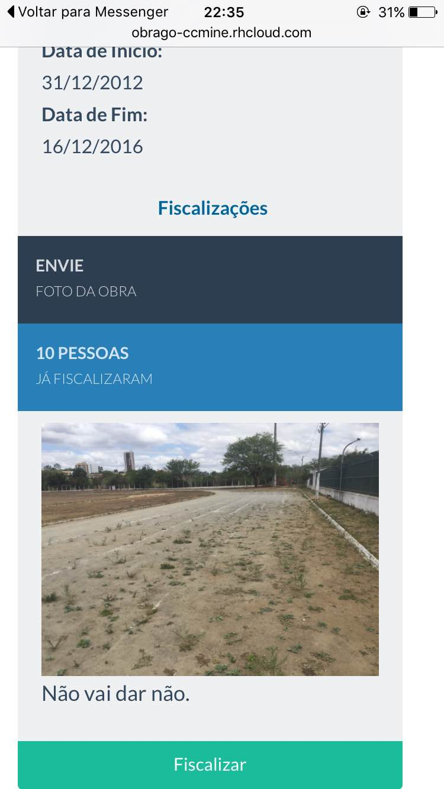
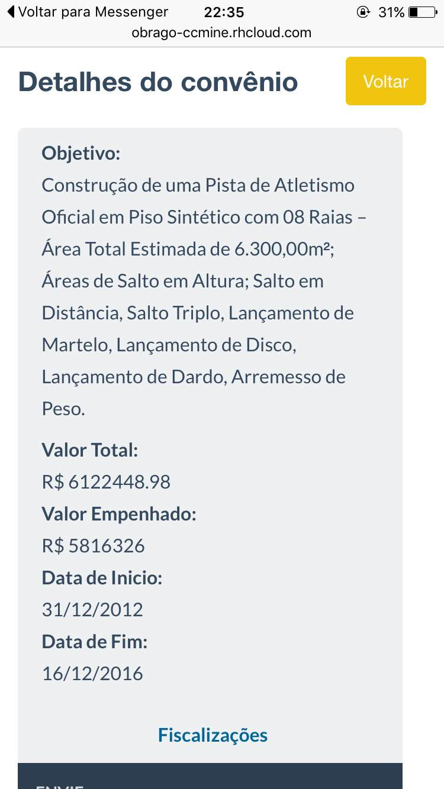

# Informações dos projetos

Clique nas figuras para ver os screenshots maiores. E lembre que são as versões iniciais dos projetos :)

---

## Enquadrados

Quantos comissionados cabem em um metro quadrado?

*site:* https://analytics-ufcg.github.io/enquadrados/

*código:* https://github.com/analytics-ufcg/enquadrados/

---

## O que faz um vereador?

O que a Câmara Municipal de Campina Grande discute e aprova? *O que faz um vereador?* torna possível acompanhar a atuação da câmara em termos de volume de proposituras, temas e relevância do que é discutido (por exemplo, nomes de rua vs projetos de lei). É possível analisar esses aspectos tanto coletivamente quanto por vereador.

*url:* Em construção.

*código:* https://github.com/antonioricardojr/vereador

---

## ObraGO

"Capture" as obras públicas na PB e compartilhe se elas foram executadas, bem feitas, e como estão!

*url:* http://obrago-ccmine.rhcloud.com/

*código:* https://github.com/analytics-ufcg/obrago

---

## Topa tudo

Que empresas Topam Tudo? Olhamos dados de licitações para procurar empresas que fornecem serviços incompatíveis com sua competência ou com seu porte, empresas de competências muito divergentes e empresas que sempre competem juntas nas mesmas licitações.

*url:* Em construção.

*código:* https://github.com/talitalobo/topatudo
