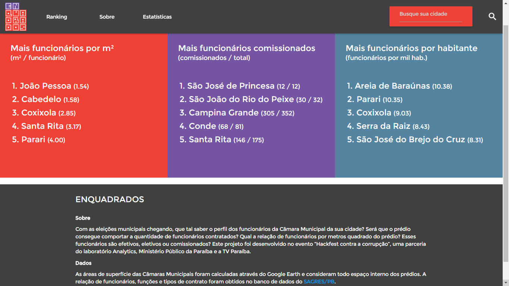
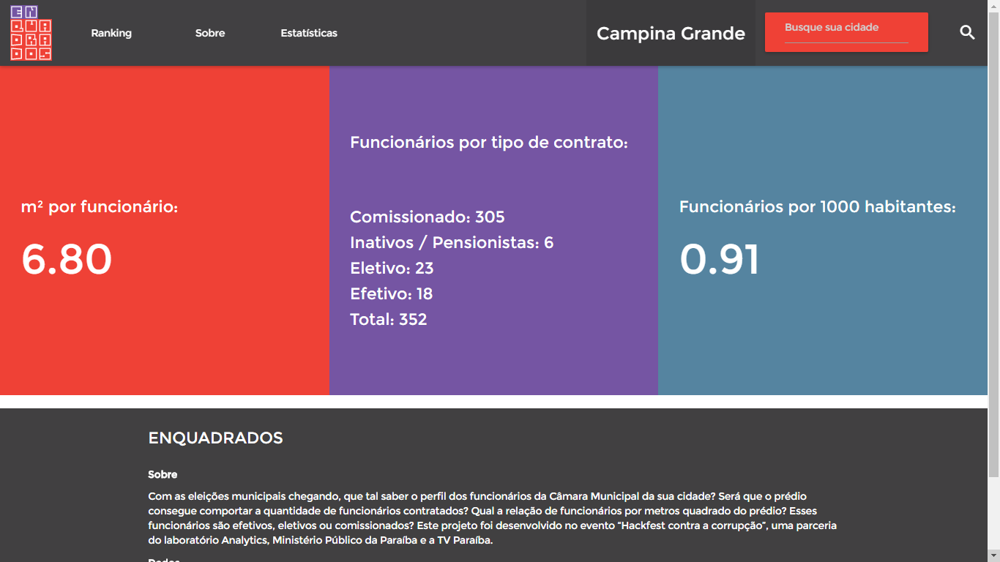
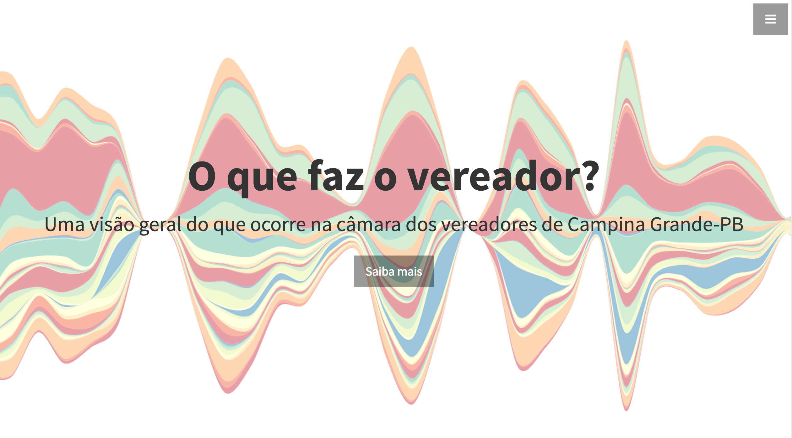
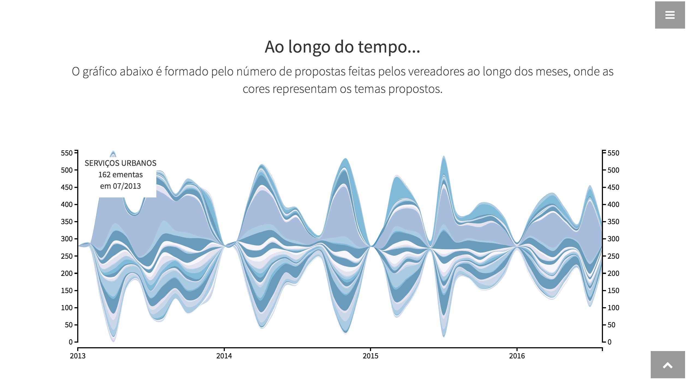
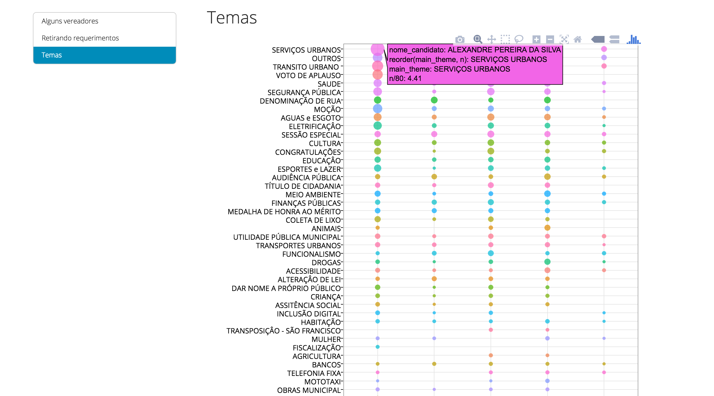

# Informações dos projetos

Lembre que são as versões iniciais dos projetos :)

## Enquadrados

Quantos comissionados cabem em um metro quadrado?

*site:* Em construção.

*código:* https://github.com/analytics-ufcg/enquadrados/

## O que faz um vereador?

Torna visível aos cidadãos o que a Câmara Municipal de Campina Grande discute e aprova. Faz com que seja possível acompanhar a atuação da câmara em termos de volume de propositura, temas e relevância do que é discutido (por exemplo, nomes de rua vs projetos de lei). É possível analisar esses aspectos tanto coletivamente quanto por vereador.

*site:* Em construção.

*código:* https://github.com/antonioricardojr/vereador

## ObraGO

"Capture" as obras públicas na PB e compartilhe se elas foram executadas, bem feitas, e como estão!

*url:* http://obrago-ccmine.rhcloud.com/

*código:* https://github.com/analytics-ufcg/obrago

